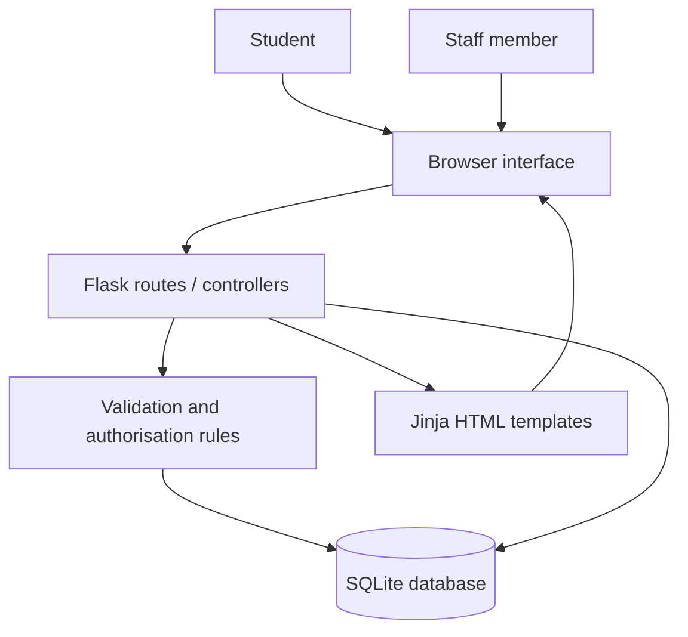
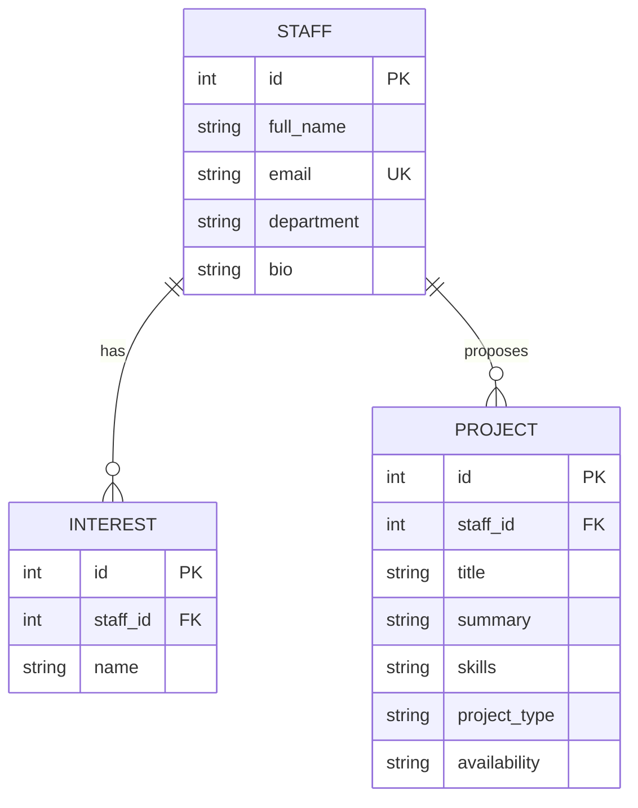

# Architecture summary

Supervisor Finder uses a **layered MVC-style web architecture**. This separates what the user sees from the application rules and the stored data, making each responsibility easier to test and change.

## Layers

| Layer | Implementation | Responsibility | Requirements supported |
|---|---|---|---|
| Presentation | `templates/`, `static/style.css` | Accessible, responsive pages, forms, feedback and navigation. | Browsing, searching, viewing project ideas, usability. |
| Controller / application | `app.py` Flask routes | Receives requests, selects views, controls session flow and calls rules. | All functional workflows. |
| Business rules | `validate_profile`, `validate_interest`, `project_values`, `staff_required`, `owned_project_or_404` | Input validation and proof that a staff member owns a record before changing it. | Correct data, security, ownership. |
| Persistence | `schema.sql`, SQLite | Stores staff, interest and project records with primary/foreign key relationships. | Accurate, current, persistent profile information. |

## Data entities

## Security note

The demonstration app uses plain-text seeded passwords only to keep the coursework setup simple. The code calls this out explicitly. A production deployment must replace this with institutional single sign-on or password hashes, HTTPS, CSRF protection and a securely managed secret key.
